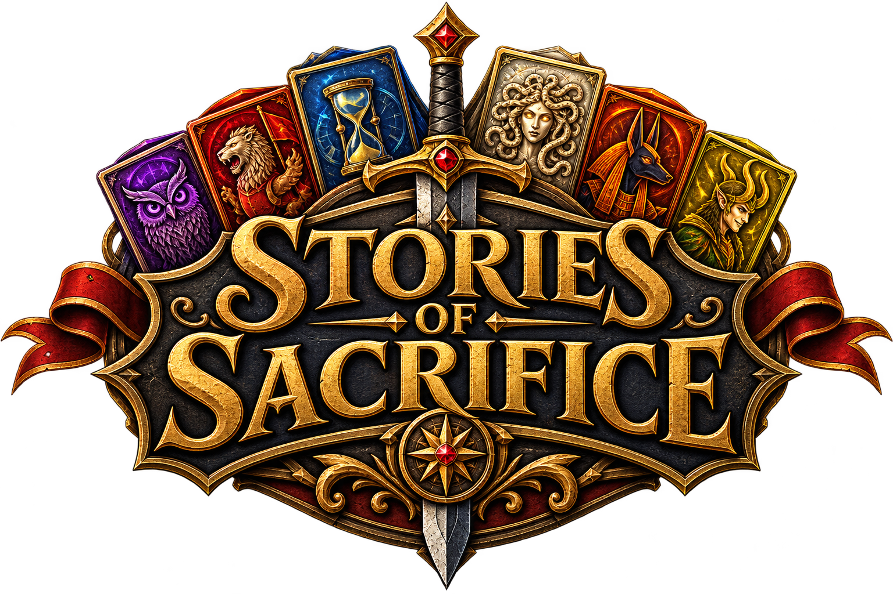
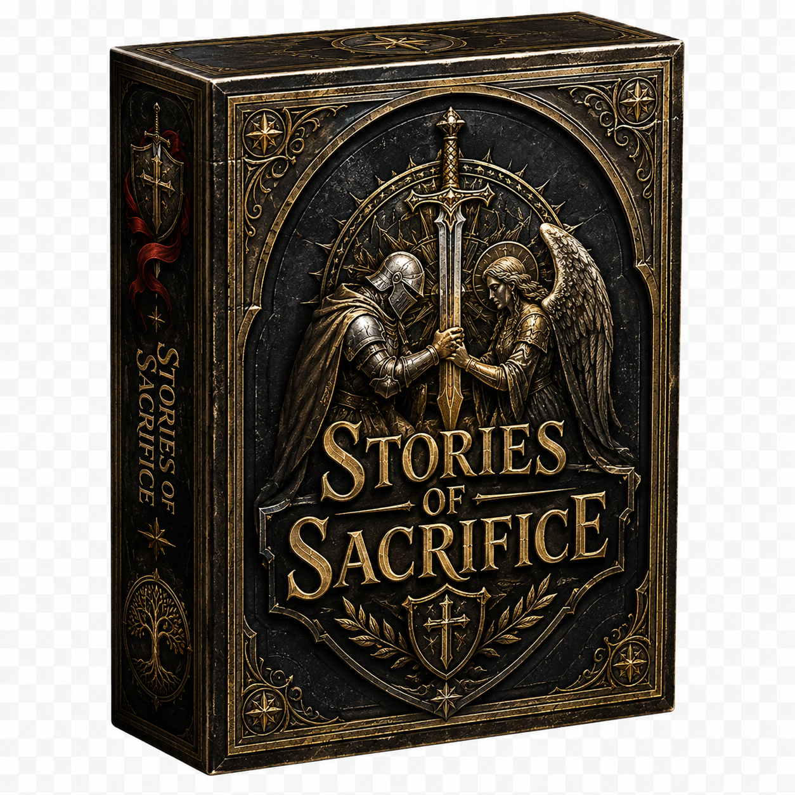
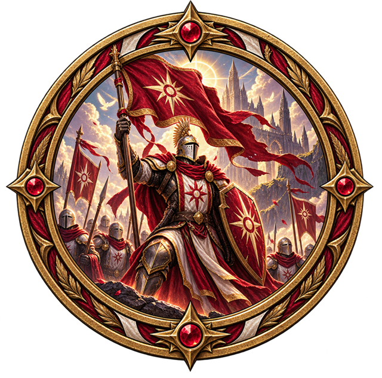
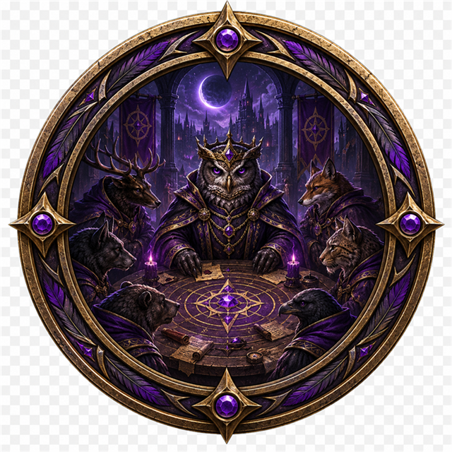
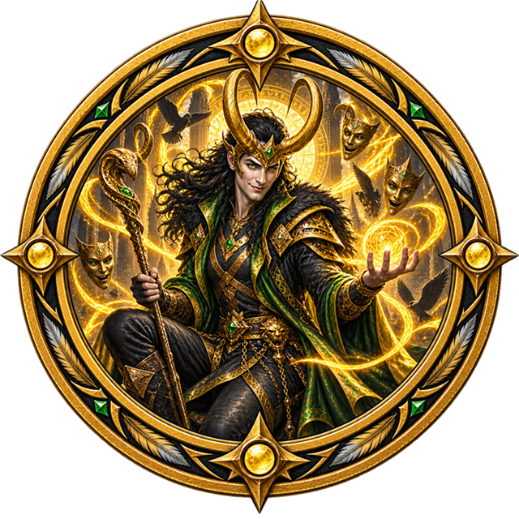
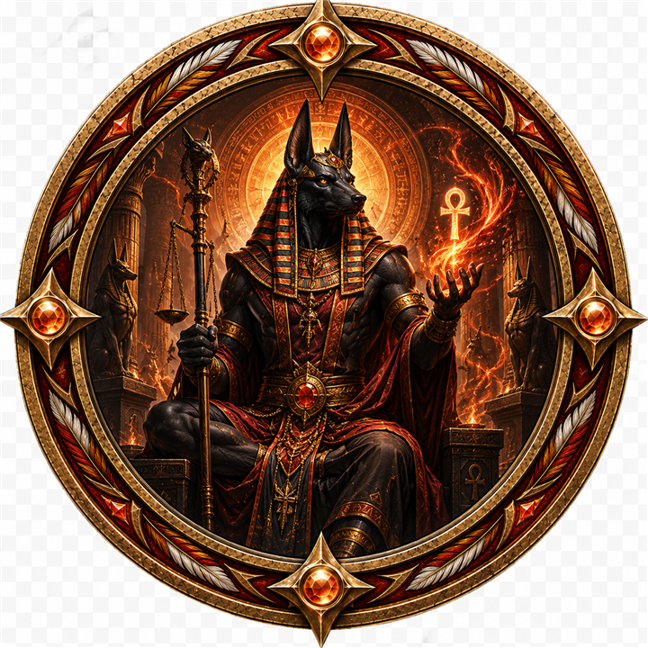
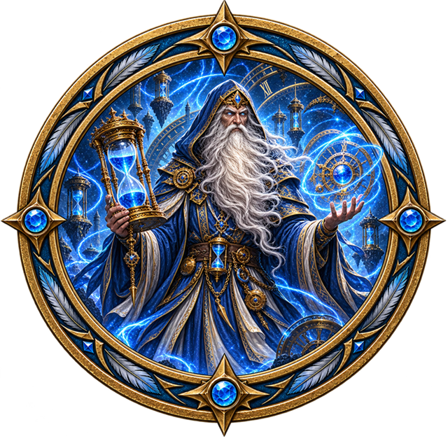
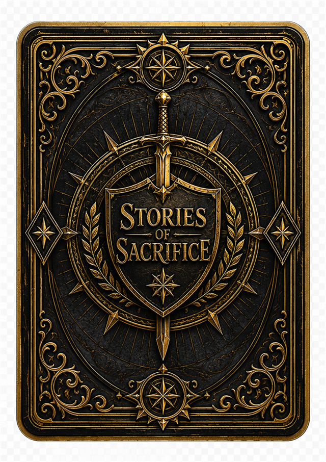

<div align="center">



# Stories of Sacrifice

### A competitive shared-market deck-building game of legends, power, and difficult choices

[](https://stories-of-sacrifice-game.jacob-s-bonnett.chatgpt.site/)
[](#how-the-story-unfolds)
[](#project-status)

*Every legend offers power. Every power demands a sacrifice.*

</div>

---

## Enter the Crossroads

Two rivals build their decks from one shared market—the **Crossroads**. Recruit heroes, unleash powerful combinations, command persistent Champions, and bargain with the figures waiting in the **Hall of Legends**.

Each player chooses two decks. Those four decks are combined with the neutral Common Purse to create a different battlefield every game. Victory comes through Prestige—or by winning the allegiance of every active Patron.

<div align="center">
  
</div>

## Choose your legends

<table>
  <tr>
    <td align="center" width="33%"><br><b>Crimson Standard</b><br>Champions, direct Power, healing, and battlefield pressure.</td>
    <td align="center" width="33%"><br><b>Midnight Parliament</b><br>Long combo chains, card draw, and adaptable resources.</td>
    <td align="center" width="33%"><br><b>Gorgon's Curse</b><br>Petrify the rival's deck and draw strength from their victims.</td>
  </tr>
  <tr>
    <td align="center"><br><b>Golden Deceiver</b><br>Coin flips, Paid Combos, discounts, and dangerous wagers.</td>
    <td align="center"><br><b>The Burning Judge</b><br>Judge future draws, recover the fallen, and disrupt enemy hands.</td>
    <td align="center"><br><b>Keeper of Hours</b><br>Gather Time, Rewind played cards, and Suspend rival Champions.</td>
  </tr>
</table>

## How the story unfolds

1. **Choose two decks per player.** Their cards form the shared Crossroads for the match.
2. **Play your hand.** Generate Grendels, Power, Time, card draw, and deck-specific effects.
3. **Build combos.** Playing cards from the same deck unlocks their strongest eligible combo tier.
4. **Recruit from the Crossroads.** Spend Grendels to add new cards to your Rest pile.
5. **Command Champions.** Champions remain on the field, retain damage, and may use their Effect once each turn.
6. **Invoke a Patron.** Pay their price to use a powerful ability and turn their allegiance dial toward you.
7. **End the turn.** Remaining Power becomes Prestige and a new five-card hand is drawn.

### Win the tale

- Reach **40 Prestige** and survive the opponent's response turn.
- If both players reach 40, the final target becomes **80 Prestige**.
- Alternatively, win immediately by securing the allegiance of all four active Patrons.

## Featured mechanics

| Mechanic | What it means |
|---|---|
| **Grendels** | Currency used to recruit cards and pay special costs. |
| **Power** | Damages enemy Champions; unspent Power becomes Prestige. |
| **Prestige** | The primary victory score. |
| **Combos** | Bonuses unlocked by playing enough cards from the same deck that turn. |
| **Paid Combos** | Optional bonuses that ask whether you want to pay their printed price. |
| **Petrify** | Creates an unplayable Petrified Villager in the opponent's Rest pile. |
| **Time** | A persistent Keeper of Hours resource, stored between turns up to 9. |
| **Rewind** | Returns an Hours action played earlier that turn from Rest to your hand. |
| **Suspend** | Prevents a chosen opposing Champion from using its next Effect. |

## Play now

The hosted prototype supports both solo play and private online rooms for two players.

### [Launch Stories of Sacrifice →](https://stories-of-sacrifice-game.jacob-s-bonnett.chatgpt.site/)

For an online match, each player chooses two decks. Create a private room and send its invitation link to your opponent.

## Run it locally

You will need a recent version of [Node.js](https://nodejs.org/) and [pnpm](https://pnpm.io/).

```bash
pnpm install
pnpm start
```

Then open the local address shown in the terminal.

To create a production build:

```bash
pnpm run build
```

To run the complete rules test suite:

```bash
node --test "tests/*.test.*"
```

## Project status

**Stories of Sacrifice is an actively developed playable prototype.** Card balance, wording, visual consistency, and individual deck identities may continue to evolve through playtesting.

Current features include:

- Six fully illustrated playable decks
- A neutral quick-use Common Purse card pool
- Persistent Champions with inspectable Effects and health
- Patron allegiance dials and alternate victory
- Solo play against the Rival
- Live private two-player matches
- Illustrated card library, Rest piles, target selectors, and animated coin flips
- Shared server-authoritative rules for multiplayer

---

<div align="center">



### The Crossroads are open. What will your victory cost?

</div>
